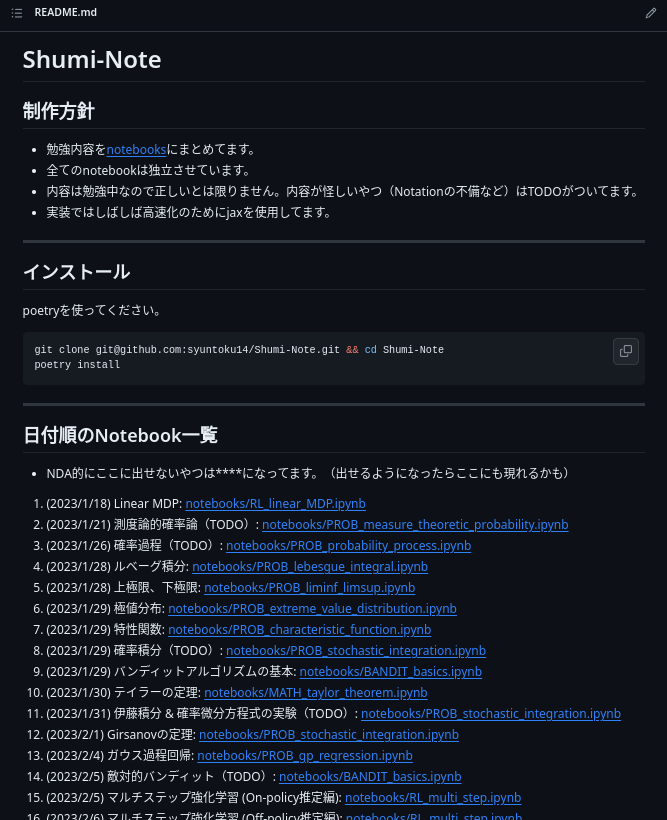
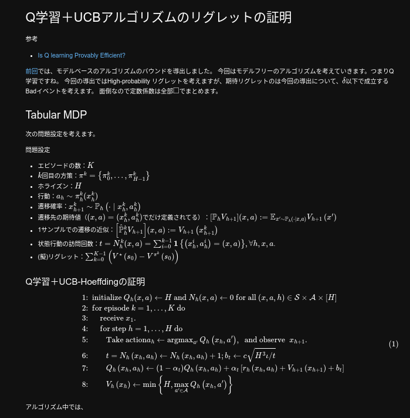

今年は主に強化学習における統計的学習理論について勉強してきました．
これはその勉強内容とやり方の備忘録です．

## 勉強のやり方（Shumi-Noteについて）

１月からずっと[Shumi-Note](https://github.com/syuntoku14/Shumi-Note)を使って勉強内容を記録してきました．
１年で約２００記事くらい書いたので，２日に１記事以上のペースで何か書いていることになります．
Shumi-Noteのテンプレートは[こちら](https://github.com/syuntoku14/Shumi-Note-Template)．
Shumi-Note自体は下の画像みたいな感じ．

今年から始めた習慣ですが，やってみてかなり良かったです．
Twitterで[Gabriel Peyré先生](https://x.com/gabrielpeyre?s=20)が一日一つCSに関する話とその実装をツイートをしているのを見たのがきっかけです．

基本方針として，「インプットした内容を，なるべく人に説明するような書き方で，Pythonのコードとともにまとめる」を意識しました．
また，次のことにも気をつけていました．

* 書いた内容は日付とともにREADMEにまとめる．
  * どれくらいの季節に何を集中的に勉強していたか振り返りやすくなり，進捗状況の把握に役立ちました．
* 一瞬で完了し，再現性の高い実装を心がける．
  * Shumi-Noteでは強化学習アルゴリズムをたくさん実装しましたが，ほとんどはnumpy (or jax.numpy)で完結しています．深層学習系は実装コストが高いため，今回は見送りました（理論保証がついてる深層学習系の話はそのうちやりたいですね）．
* ストレスにならないように自分のペースで書く．
  * 丁寧に書いた記事も，かなり適当に書いた記事もあります．記事は下の画像みたいな感じ．

## 勉強の内容

強化学習の理論をやるために必要な知識を勉強していました．
ここではその中でも体系的な知識をつけるために役に立った資料をまとめておきます．細かい知識の話は[アドベントカレンダー](https://qiita.com/advent-calendar/2023/rl-theory)にでも書こうと思います．
基本的に勉強した内容はShumi-Noteにまとめ，理解を深めていました．

### 測度論的確率論（去年の中旬〜今年の初旬）

バンディットや強化学習の理論を理解するために確率論はとても重要です．恥ずかしながら博士課程１年目の半ばごろまで測度論的確率論に触れてこなかったので苦労しました．
用語と定義を覚えないと話にならないので，下の３つの本に出てくる用語や定義，定理の証明を読み込んでいました．（[Goodnote](https://www.goodnotes.com/)と[Anki](https://apps.ankiweb.net/)を使っていました．）

* [測度・確率・ルベーグ積分 応用への最短コース (KS理工学専門書)](https://amzn.asia/d/1KMEEDC)
  * 実際この本は応用への最短コースでした．よく使う話が短く，しかし丁寧にまとまっており，非常に助かりました．
* [舟木確率論](https://amzn.asia/d/1mgAy7o)
  * わからないところはこれを適宜参考にしてました．
* [東大の鈴木先生の講義](http://ibis.t.u-tokyo.ac.jp/suzuki/lecture/2022/index.html)
  * 東大の鈴木先生の確率数理要論を受講してました．（成績は「可」でした．トホホ…）
* [Bandit Algorithms](https://tor-lattimore.com/downloads/book/book.pdf)
  * とても良い本です．Part1にバンディットに必要な確率論の話が体系的にまとまっているので，この本をひたすら読む＆章末問題を解きまくっていました．

**主なShumi-Noteの記録**：[このへん](https://github.com/syuntoku14/Shumi-Note/tree/main#%E7%A2%BA%E7%8E%87%E8%AB%96%E5%85%A5%E9%96%80)

### バンディット（ずっと）

バンディットを理解しないと強化学習に置ける探索の話ができません．
以下の資料で体系的に勉強しました．

* [Bandit Algorithms](https://tor-lattimore.com/downloads/book/book.pdf)
  * とにかくこれを読み込んでいました．
また，友人＆メンターと章末問題を解きまくる会を毎週開催していました．
* [バンディット問題の理論とアルゴリズム](https://amzn.asia/d/fBxP4Vb)
  * 証明に詰まったときに参考になります．こちらのほうがBandit Algorithmsよりもわかりやすい説明もいくつかありました．
* [RL Theory and Algorithms](https://rltheorybook.github.io/)
  * ６章がバンディットの話です．証明が非常にわかりやすいので参考になります．

**主なShumi-Noteの記録**：[このへん](https://github.com/syuntoku14/Shumi-Note/tree/main#%E9%80%90%E6%AC%A1%E6%84%8F%E6%80%9D%E6%B1%BA%E5%AE%9A%E5%95%8F%E9%A1%8C)

### 強化学習（ずっと）

修士までは[強化学習 (機械学習プロフェッショナルシリーズ)](https://amzn.asia/d/91JDd35)をひたすら読み込んでいました．
博士からは強化学習についての統計的学習理論を，以下の資料をベースに勉強していました．

* [Csaba先生のRLTheory講義](https://rltheory.github.io/)
  * これの翻訳会に参加していました．非常によくまとまった資料です．ICMLに出した論文でも，ここで勉強した内容がとても参考になりました．
* [RL Theory and Algorithms](https://rltheorybook.github.io/)
  * メインで勉強していた本です．現在進行系でこれの勉強会を主催しています．担当者が一つの章を読み込んで，それを画面シェアで聴講者に説明する形式で勉強会していました．この資料の証明はかなり読みやすく，論文執筆で重宝しています．
* [Convex Optimization](https://web.stanford.edu/~boyd/cvxbook/bv_cvxbook.pdf)
  * Boyd本です．過去に何度か読んでいましたが，改めて読み直していました．強化学習でもめちゃめちゃ使います．この話は別の記事で書きます．

**主なShumi-Noteの記録**：[このへん](https://github.com/syuntoku14/Shumi-Note/tree/main#%E9%80%90%E6%AC%A1%E6%84%8F%E6%80%9D%E6%B1%BA%E5%AE%9A%E5%95%8F%E9%A1%8C)

## 来年頑張りたい話

* Bertsekas先生のDynamic Programming and Optimal Control：買ったけど積んでる．読まねば...
* [Concentration inequalities](https://www.hse.ru/data/2016/11/24/1113029206/Concentration%20inequalities.pdf)：読まなきゃなあ〜って気持ちのまま一年が過ぎました．
* [統計的学習理論 (機械学習プロフェッショナルシリーズ)](https://amzn.asia/d/4NckyPM)：ちょこちょこ読んでますが，未だ熟読せずに一年が過ぎました．
* [機械学習のための連続最適化](https://amzn.asia/d/60AVg26)：同上．論文で使うところだけ読んでましたが，未だ熟読せずに一年が過ぎました．

## 総括

これから強化学習の統計的学習理論を始める方は，とりあえず[Bandit Algorithms](https://tor-lattimore.com/downloads/book/book.pdf)と[RL Theory and Algorithms](https://rltheorybook.github.io/)が読めるように勉強し，それぞれの章末についているBibliographyの論文を参照していけば必要な知識はつきそうです．
僕自身まだまだ勉強中なので，一緒に勉強したい方がいればTwitterなどでお気軽に声かけてください．

今年はのんびり勉強できた一年で，非常に楽しかったです．特にShumi-Noteの実装をしているときはかなり楽しいですね．お気に入りの記事や実装については別のブログにまとめようと思います．
来年も頑張るぞ．