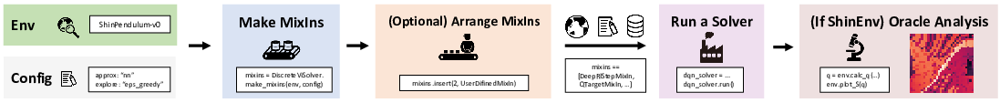
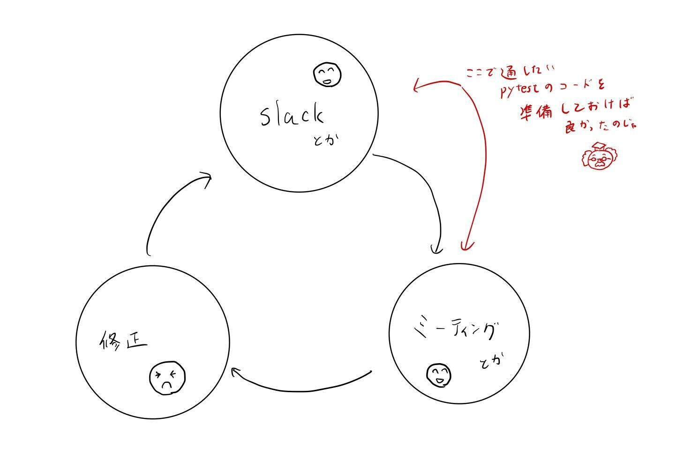

2021年6月から2022年2月まで, [オムロンサイニックエックス (OSX)](https://www.omron.com/sinicx/) にて研究インターンをさせていただきました. 
これはOSXインターンについてまとめたポストになります.
元インターンの[奥村さんのポスト](https://kei18.github.io/posts/20211129_osx-intern.html)も参考になるのでぜひ.

## 自己紹介

* 現在は奈良先端科学技術大学院大学の修士２年, 2022年の4月から東京大学で博士課程に進学予定の学生です.
* 学部の頃はロボットよりの研究をしていましたが, 修士課程では強化学習の理論やアルゴリズムがメインの研究をやっていました. 
* 詳しくは[ホームページ](https://syuntoku14.github.io/)を見てね.

## インターンまでの経緯

M2の前半で主著を1つ & 共著を2つ生やすことができたので, M2の後半はインターンやりたいなあ〜って思っていたところ, 研究室経由でメンターの[米谷さん](https://yonetaniryo.github.io/)からOSXインターンのお誘いをいただきました.
待遇や時期的にもかなり好条件だったので即返事をし, フルタイムで半年以上の研究インターンに参加させていただきました.
インターンへの応募は[ここ](https://medium.com/sinicx/fy2021-%E7%A0%94%E7%A9%B6%E3%82%A4%E3%83%B3%E3%82%BF%E3%83%BC%E3%83%B3%E3%81%AE%E5%8B%9F%E9%9B%86-fd6cc05e8098)に詳細があります. 興味がある人はぜひ.

## 何をやったのか

強化学習の理論と応用の実験をサポートしたライブラリ [ShinRL](https://github.com/omron-sinicx/ShinRL) を開発しました.
当初は米谷さんの提案で別の強化学習のテーマに取り組んでおり, 僕が個人的に開発していたShinRLを使ってデバッグ & アルゴリズムの実装を進めていました.
もっとShinRLを高速化したい, 実装をキレイにしたい, などの理由で途中からShinRLの開発にシフトし始め, 最終的にはOSXとしてオフィシャルに公開するのを目標にテーマを変更しました (米谷さんには快く承諾していただきました. 圧倒的感謝です).

最初は[PyTorch](https://pytorch.org/)で実装していたShinRLですが, 速度面や実装の単純さ, 勉強目的から[JAX](https://github.com/google/jax)を利用して実装することに.
米谷さんもJAXは初めてだったので, お互いに情報を共有しあって実装のアイデアを提案しまくりました.
インターンは完全リモートでしたが, 

* githubのissueで毎日進捗管理
* slackで必要に応じて質問を投げ合う
* 週一のミーティング

を徹底して頂き, 遠隔でも充実した開発環境が整っていたと思います.
週一のミーティングでなんとなく出したアイディアが実装に活かされることがよくあったので, やっぱ定期的な同期コミュニケーションは大事ですね (例えばMixInシステムやJAX自体もミーティングでなんとなく出したアイディアになります. [論文](https://arxiv.org/abs/2112.04123)参照).

## ライブラリ開発の流れ

もともとあったライブラリのコンセプトをベースに, 

* 実装の柔軟さ
* 単純さ
* 速さ

を向上させようとライブラリの破壊と創造を繰り返しました.
とにかく 「僕がアイディアを実装して米谷さんに説明」 → 「伝わらなければ作り直し」 のサイクルを回しまくり, ほぼ常にコーディングをしていた感じです.
ある程度形になってからはNeuripsのDeep RL Workshopで発表するために論文化の作業に移り, ShinRLのユースケースを書く作業も並行して進めていました. 
米谷さんによる論文執筆の補助のおかげで, なんとか論文も発表できるレベルまでもっていけました (圧倒的感謝２です).

## よかったこと

JAXや論文執筆力が身についたのはもちろんなんですが, **わかりやすくコードを書く力** が改めて成長しました.
以前から一応[リーダブルコード](https://www.oreilly.co.jp/books/9784873115658/)に書いてあることを意識してコーディングはしていたのですが, 自分一人で開発していると限界があります.
OSXインターンでは週一回のミーティングで進捗やコードを説明する機会があり, ミーティングで伝わらない話は基本的にShinRLのユーザーにも伝わらないと思っていました.
自分で「あれ, ここは分かりづらいな？」と思った箇所は米谷さんに説明してみて, 反応を見て分かりづらそうだったら書き直し, を繰り返すうちにコードの可読性を上げる能力が向上していきました.
個人的に研究室や以前のインターンなどでも週一くらいでミーティングはあったんですが, コードレビューに近いことはしたことがなかったので今回はめちゃくちゃ良かったですね.
米谷さんも頻繁にコードの改良に参加してくれるので, 自分では思いつかない実装アイディアもたくさん出ました.

## 反省点

もっとテスト駆動開発を徹底したほうが良かったかもしれません.
開発は基本的に
1. githubのissueやslackで「〜を実装しようかなって考えてます」って報告
2. 米谷さんの意見を踏まえて実装
3. 実装した後でissueやミーティングで説明
4. 反応を見て修正

のサイクルでした.
1と2では文章だけで説明していたので, 説明のし忘れや勘違いなどが頻発しました. 
僕自身も後で実装したのが「なんか違うな...」になることが多く, サイクルを回す回数が無駄に多くなってしまいました.
反省点として, 1の時点で通っておくべきテストコードをたくさん書けばよかったなと思っています (研究してると忘れがちになっちゃう...).
一応[pytest](https://docs.pytest.org/en/7.0.x/)による動作確認はなるべく徹底していたんですが, それがミーティングや要件定義に活かされていませんでした (次の開発では徹底していきたいです. 反省.).

## まとめ

OSXのインターンは全体としてとても良かったです.
サポートがとにかく手厚いのでリモートでもほぼ問題ありませんでした. 
研究に少し余裕が出てきたり, 新しいことに挑戦したい学生の方には参加してみて欲しいと思います.
余談ですが, インターン期間中に２回だけオフィスの方に顔を出したことがあります.
キレイなオフィス & 立地的に便利なところ だったので現地で働くともっと楽しいかも？
OSXインターンめっちゃ良いので, 気になる人はぜひ[応募してみてね！](https://medium.com/sinicx/fy2021-%E7%A0%94%E7%A9%B6%E3%82%A4%E3%83%B3%E3%82%BF%E3%83%BC%E3%83%B3%E3%81%AE%E5%8B%9F%E9%9B%86-fd6cc05e8098)